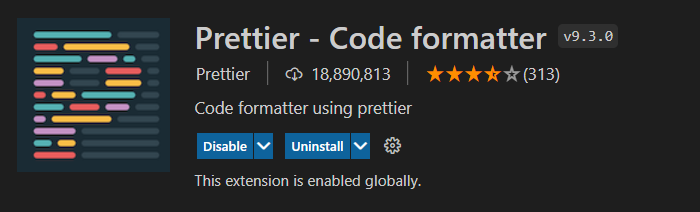

# CodeLab

## Part 1: VSCode

1. Install **Prettier** plugin




2. Install **Eslint** plugin


## Part 2: Eslint
1. Open your package.json, go down there on the **eslintConfig** and leave it as the next is:
	```json
	"eslintConfig": {
		"extends": [
			"eslint:recommended",
			"react-app",
			"react-app/jest",
			"prettier"
		]
	},
2. run ***npm i -D eslint***


3. add this 2 new scripts to the **package.json**
	```json
	"lint": "eslint --ext .js,.jsx .",
	"lint:fix": "npm run lint -- --fix"
	 ```
4. If you installed **eslint** plugin the eslint errors will popup when you hover on warning messages on your code, for instance:


Eslint Funcionando


## Part 3: Prettier
1. go to your package.json
2. add a new key down below **eslintConfig**, like this:
    ```json
    "prettier": {}
    ```
3. Go to ***file/preferences/settings*** another alternative is pressing on windows **ctrl + ,**
4. On the User configuration open ***Text Editor / Formatting***
5. Click on **Format On Save** checkbox.


## Part 4: Husky
1. run ***npm i -D husky***
2. run ***npm set-script prepare "husky install"***
3. run ***npm run prepare***
4. run ***npm i -D prettier***
5. run ***npm set-script format "prettier --write ."***
6. run ***npx husky add .husky/pre-commit "npm run lint:fix && npm format"***
7. Now, every time you try to run a commit it will validate there are no eslint **Errors** ( Not warnings ), and then it will format every file on your project using our prettier config.
